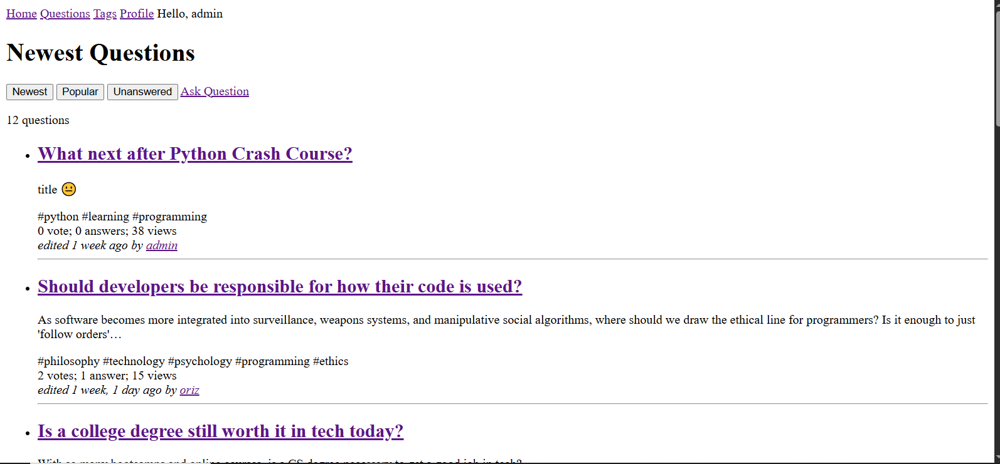
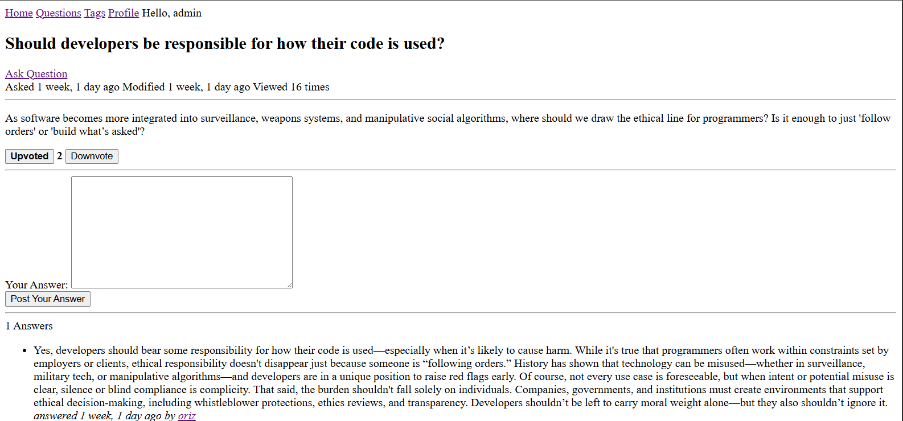
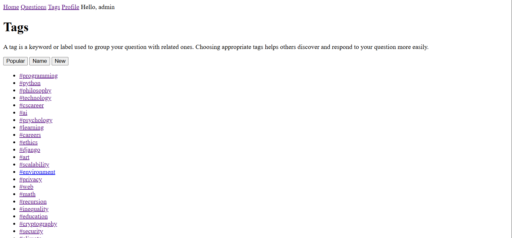
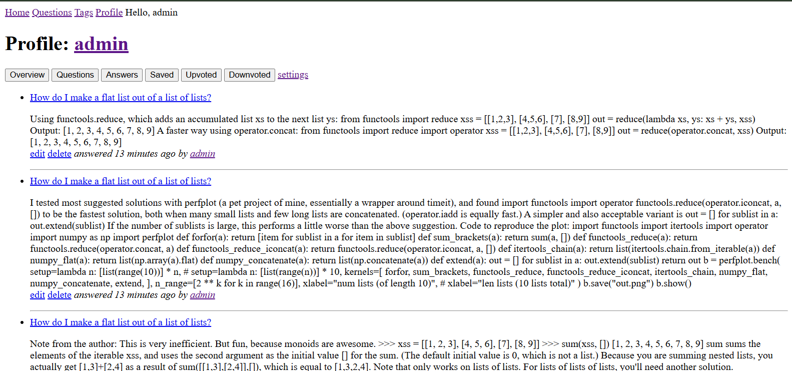

# QnA Forum – Django Web Application

A simple, lightweight **Question-and-Answer forum** built with Django.
Users can post questions, answer others, upvote/downvote, and organize content using tags.

## 📸 Screenshots






## ✨ Features

* **User Authentication**

  * Sign up, log in, change password, and delete account.

* **Ask & Answer Questions**

  * Post new questions with titles, descriptions, and tags.
  * Provide answers to existing questions.
  * Edit and delete existing questions and answers.

* **Voting System**

  * Upvote/downvote both questions and answers.

* **Tagging System**

  * Categorize questions with relevant tags.
  * Browse popular, new, or narrow tags.

* **Profile Page**

  * View your questions, answers, and votes. 
etc ...


## 🛠 Tech Stack

* **Backend:** Django (Python)
* **Frontend:** Django templates
* **Database:** SQLite (default, easily switchable to PostgreSQL/MySQL)
* **Authentication:** Django’s built-in auth system

## 🚀 Installation

1. **Clone the repository**

   ```bash
   git clone https://github.com/OrizWasTaken/qna-forum.git
   cd qna-forum
   ```

2. **Create and activate a virtual environment**

   ```bash
   python -m venv venv
   source venv/bin/activate    # On macOS/Linux
   venv\Scripts\activate       # On Windows
   ```

3. **Install dependencies**

   ```bash
   pip install -r requirements.txt
   ```

4. **Run migrations**

   ```bash
   python manage.py migrate
   ```

5. **Create a superuser**

   ```bash
   python manage.py createsuperuser
   ```

6. **Run the development server**

   ```bash
   python manage.py runserver
   ```

7. **Access the site**

   ```
   http://127.0.0.1:8000
   ```

## 📂 Project Structure

```
qna-forum/
│
├── accounts/               # Authentication and profile management
├── qna_site/               # Main Django project configuration
├── qnas/                   # Main app for Q&A features
├── manage.py
└── requirements.txt
```

## 📜 License

This project is licensed under the **MIT License**

---